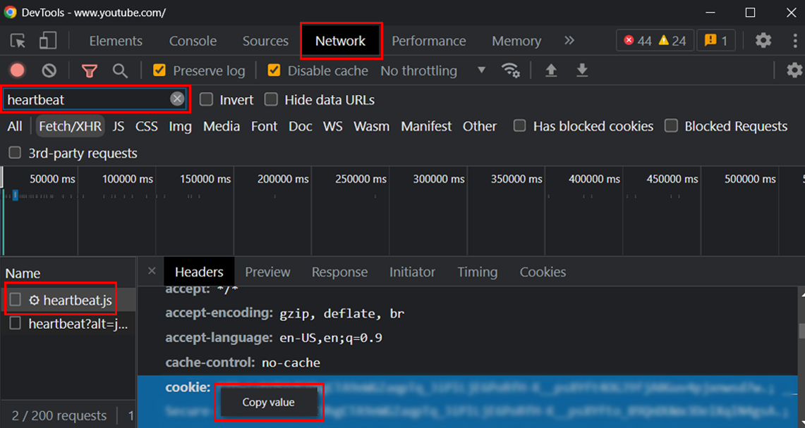

# Zotero Media Downloader

**A NodeJS based media downloader capable of saving 4k videos from your Zotero collection to your local computer or network storage location using FFmpeg.**

This application uses ytdl-core, FFMPEG-static and the axios to interact with the [Zotero Public API](https://www.zotero.org/support/dev/web_api/v3/start) Note: You do not need to install a 3rd party version of FFMPEG to use this app.

this application automatically creates and manages a `manifest.json` file to track which videos have been downloaded already. If a video's unique video ID is in the manifest, it will not be redownloaded even if it is present in the specified zotero collection, and even if the video is not in the destination directory. You can manually edit the `manifest.json` file if you need to redownload a video (e.g. if you deleted the downloaded file accidentally)

***

## Installation & Configuration

1. in your project, run this command: `npm install zotero-media-downloader`
2. to run zdl as a standalone server, import `config` and `run` functions from the package, and use them in the following way:
```js
const { config, start } = require('zotero-media-downloader');

const main() {
    config({
        ZOTERO_API_KEY: "<your-zotero-api-key>",
        ZOTERO_USER_ID: "<your-zotero-user-id>"
    });
    start();
}

main();
```

3. In the Zotero Desktop or Web App, create a new `collection` that matches the value you have specified for your `ZOTERO_VIDEO_COLLECTION_NAME` environment variable in your config. e.g. `zytdl`. You can also create and specify `ZOTERO_AUDIO_COLLECTION_NAME` in the same way. See Below for all config properties.
4. While Zotero Desktop and `zotero-media-downloader` server are running, use the Zotero Connector browser plugin to add urls to the specified collection.
5. Monitor the console and your specified output directory for newly downloaded videos.  

***

## Configuration

Note: some of these values like `ZOTERO_API_KEY`, `ZOTERO_USER_ID`, and `YT_USER_COOKIE` should be specified in a .env file and not commited to your source control to protect their sensitivity. This is not in the scope of this README, please see packages `dotenv` && `dotenv-parse-variables` for more information. 

| Property Name                    | Data Type | Required | Default Value | Description                                                                                                                                     |
|----------------------------------|-----------|----------|---------------|-------------------------------------------------------------------------------------------------------------------------------------------------|  
| ZOTERO_API_KEY                   | String    | yes      | ""            | Your API key from Zotero. See Instructions Below. |
| ZOTERO_USER_ID                   | String    | yes      | ""            | Your User ID from Zotero. See Instructions Below. |
| ZOTERO_VIDEO_COLLECTION_NAME     | String    | no       | "zdl_video"   | The name of the Zotero collection you want to be monitored for video download links. |
| ZOTERO_AUDIO_COLLECTION_NAME     | String    | no       | undefined     | The name of the Zotero collection you want to be monitored for audio download links. |
| YT_USER_COOKIE                   | String    | no       | ""            | Youtube cookie value from your browser. required for certain age restricted videos. See Instructions Below. |
| VIDEO_FILE_FORMAT                | String    | no       | "mp4"         | The format you wish to save videos in. Some options are "mp4", "mkv" |
| AUDIO_FILE_FORMAT                | String    | no       | "mp3"         | The format you wish to save audio in. Some options are "mp3", "flac". |
| BASE_PATH                        | String    | no       | "/"           | Path to the location you wish downoaded content to be saved in. Can be an absolute or relative path. |
| DEBUG                            | Boolean   | no       | false         | Prints additional console information. |
| DRYRUN                           | Boolean   | no       | false         | Will prevent any videos rom actually being downloaded. Zotero API will still be accessed like normal |
| LOOP_INTERVAL_MINUTES            | Number    | no       | 5             | This is the number in minutes that zotero will be polled for new videos in the specified collections |
| CHANNEL_DOWNLOAD_MAX_DEPTH       | Number    | no       | -1            | If channel links are detected in the collection, this value refers to the max number of most recent videos to download from the channel. |
| DOWNLOAD_BATCH_SIZE              | Boolean   | no       | 5             | The number of videos to download simulaneously. This value should be increased or decreased depending on the speed of your internet connection. |
| PRESERVE_LOG                     | Boolean   | no       | false         | If set to true, prevent the console output from clearing after each loop | 

***

## Advanced Usage

### **How to Find your Zotero API key and User ID**

To find your `API key` and `userID` for zotero, login to your zotero web account and navigate to https://www.zotero.org/settings/keys 

1. On this page look for `"Your userID for use in API calls is <YOUR_USER_ID>"` and copy your user id to your config
2. Create a new `API key` by clicking on `Create new private key`. Once named and configured (Defaults should be fine), click `Save Key` and copy the string to your config.

### **How to find your Youtube cookie value**

1. open chrome
2. navigate to youtube and login to your (age-unrestricted) account.
3. press `f12` or right click the page, and select `inspect element`
4. select the `network` tab in chrome dev tools
5. navigate to any youtube video in your browser
6. in the chrome dev tools filter box, search for `heartbeat`, select  it in the list. (many requests will have this value, heatbeat is just an example)
7. Expand/Scroll to the `Request Headers` section on the right. 
8. copy the full `cookie` request header value and paste it in your config.
9. 

### **Using the DownloadManager class directly**

If you need more control over how and when downloading occurs, you can import the DownloadManager class directly and use it as required. Note: the config function automatically injects your config into process.env

```js
    const {config, loop, DownloadManager} = require('zotero-media-downloader');
    const main customUsage = async () => {
        config({
            ZOTERO_API_KEY: "<your-zotero-api-key>",
            ZOTERO_USER_ID: "<your-zotero-user-id>"
        });

        const { LOOP_INTERVAL_MINUTES, DRYRUN }  = process.env;
        await DownloadManager.buildManifest();
        DRYRUN && console.log(`[DRYRUN] no videos will be downloaded and the manifest will not be changed. The Zotero API will still be accessed.`)
        setInterval(loop, LOOP_INTERVAL_MINUTES * 60 * 1000);
        loop();
    }

    customUsage();
```

***

## Roadmap

- [x] Release working downloader service
- [x] add filetype options for audio (mp3)
- [x] add youtube channel downloading support
- [X] download batching
- [x] Distribute `zotero-media-downloader` as an NPM package
- [ ] add quality options
- [ ] investigate if this tool can be turned into a zotero plugin
- [ ] improve folder stucture and zotero collection structure to use nesting for better organization
- [ ] add youtube playlist downloading support
- [ ] add other services besides youtube
- [ ] multithreading, proxies

***

## Changelog
- [x] **1.0.0** Connects Zotero API to the downloader service. Limited customizability
- [x] **1.1.0** Added support for Audio file downloading
    - Added support for downloading audio streams from youtube, and saving them in a configurable audio file format.
    - Added `Dryrun` mode
    - Improved error handling and debugging
    - changed package name from `zotero-youtube-downloader` to `zotero-media-downloader`
    - removed most references to `youtube` in the `README.md` to prepare for adding more downloaders
    - Environment variable changes
        - added `DRYRUN`
        - removed `SUB_DIRECTORY`
        - renamed `ZOTERO_COLLECTION_NAME` to `ZOTERO_VIDEO_COLLECTION_NAME`
        - added `ZOTERO_AUDIO_COLLECTION_NAME`
        - renamed `FILE_FORMAT` to `VIDEO_FILE_FORMAT`
        - added `AUDIO_FILE_FORMAT`
- [x] **1.1.1** Added support for channel downloading
- [x] **1.1.2** 
    - Bugfixes and improvements for channel downloading
        - fixed bug where downloading channels with different YT url structures would not work (now supports /user/ and /channel/)
        - fixed a bug where only the latest 30 videos from a channel would be downloaded. Now all are downloaded.
    - Added envionment variable `CHANNEL_DOWNLOAD_MAX_DEPTH` to limit maximum number videos that can be downloaded from a channel
- [X] **1.1.3** implemented download batching
- [X] **1.2.0** distributed as an NPM package, Changed Usage. Eliminated Environment variables to support new package distribution method.
- [x] **1.2.1** added registry to package.json
- [x] **1.2.2** fixed url in registry package.json
- [x] **1.2.3** improved logging and exports (usage)

***